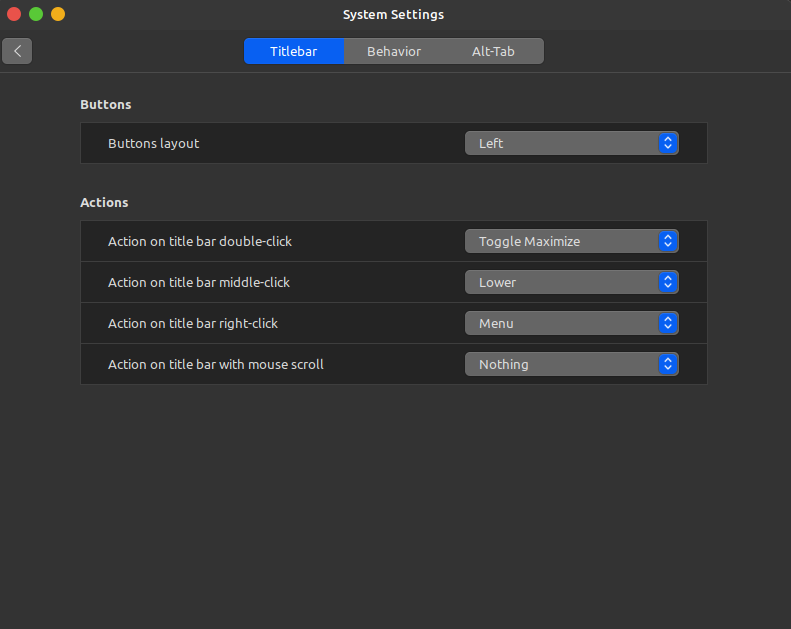
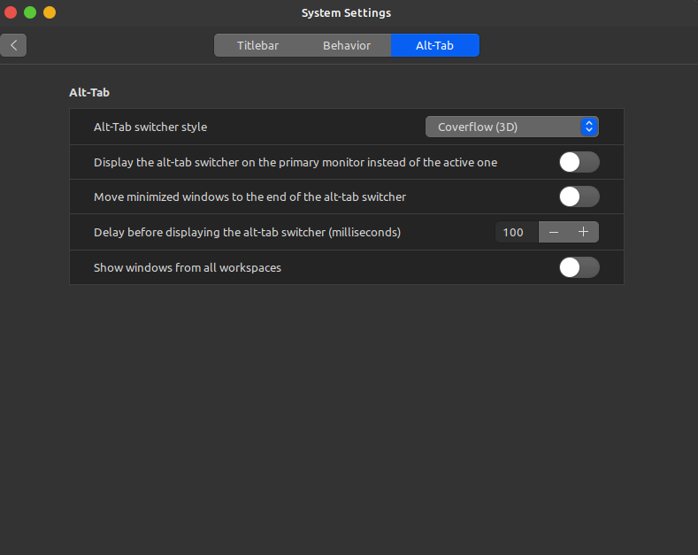

1. System Settings --> Windows

Titlebar --> Buttons --> Buttons layout --> Left

Alt-Tab --> Alt-Tab --> Alt-Tab switcher style --> Converflow(3D)

2. System Settings --> Hot Corners

Enable this corner --> + --> Show all windows

3. System Settings --> Extensions

Download --> update --> search "Transparent panels" --> install

Manage --> enable "Transparent panels"